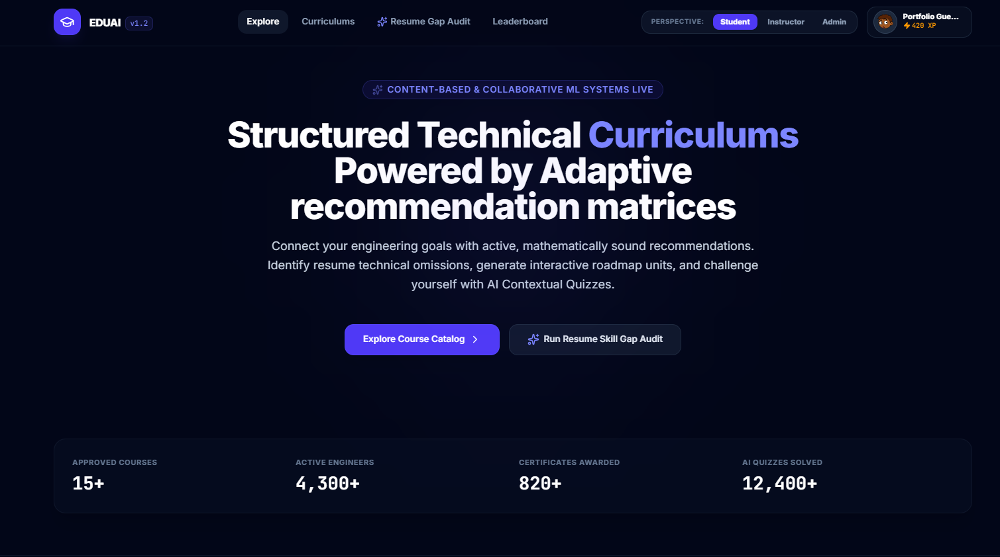
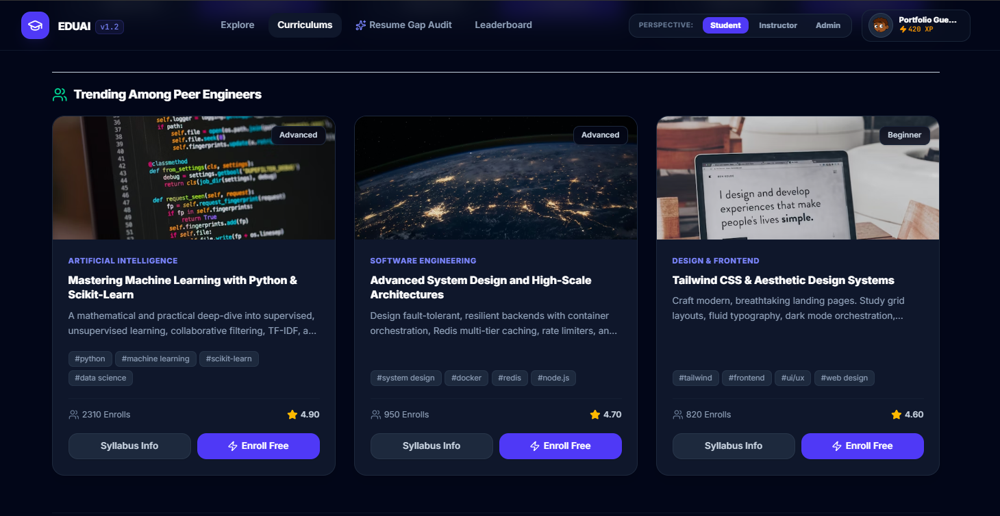
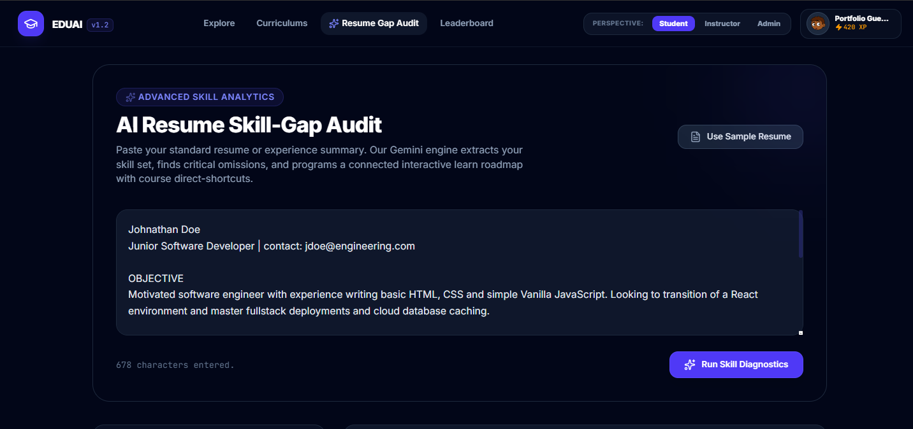
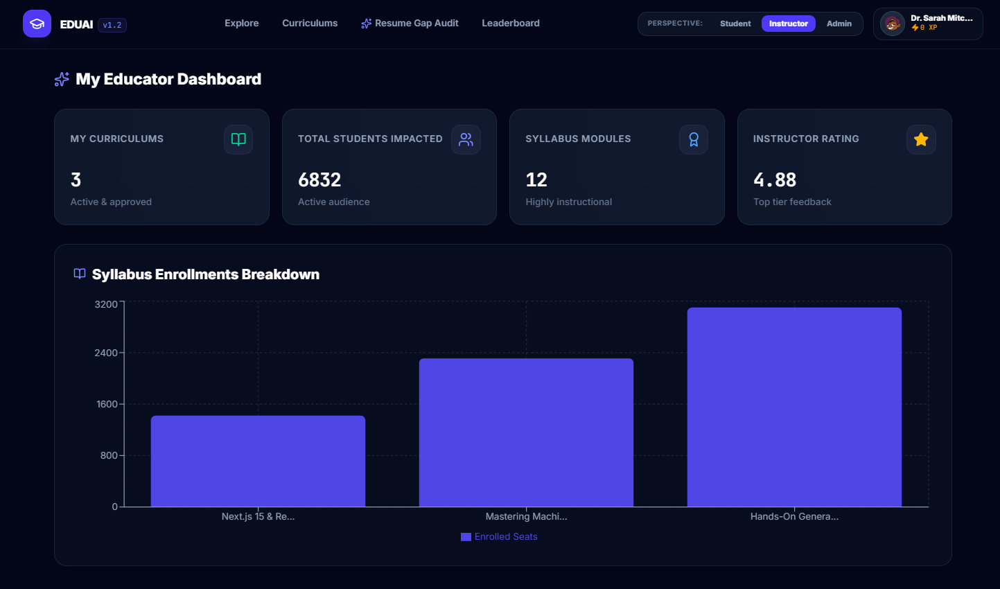
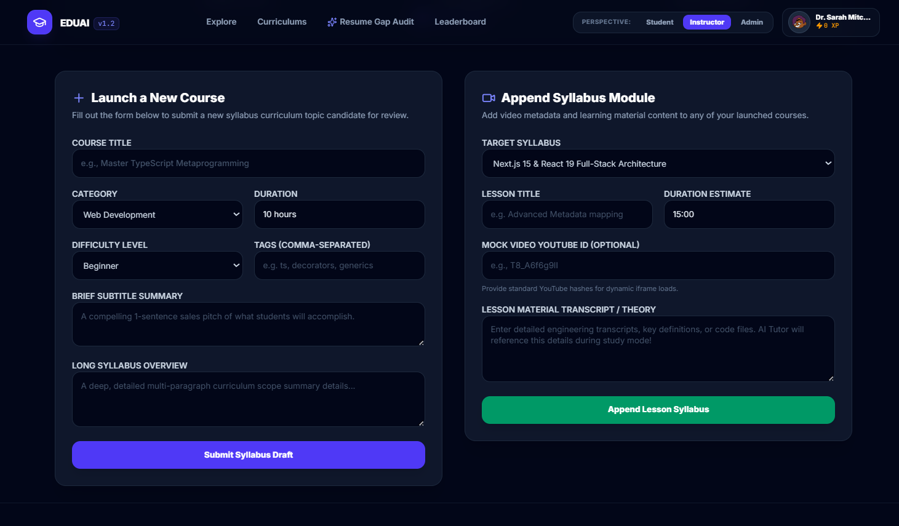
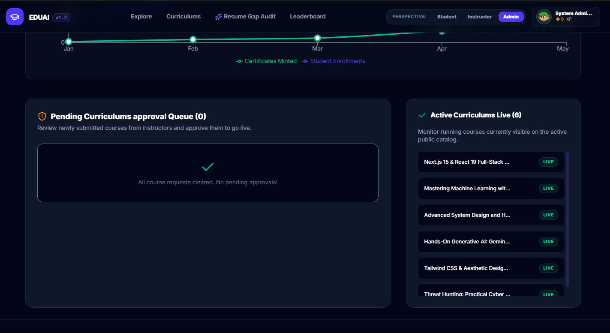
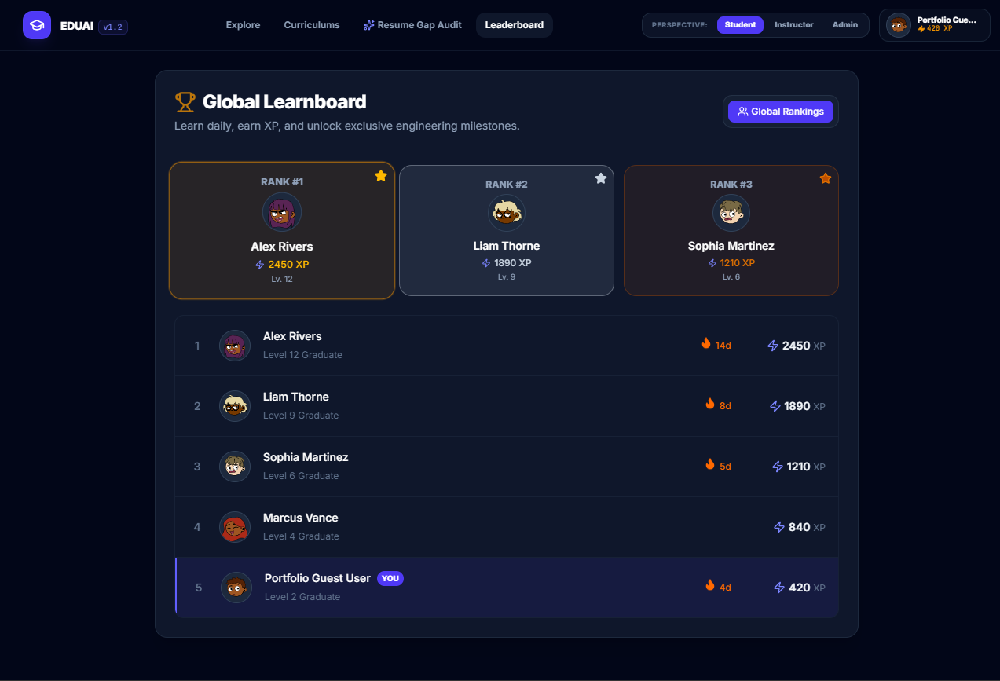

# 🚀 EDUAI - AI-Powered Learning & Recommendation Platform


> A production-grade, AI-driven EdTech SaaS platform featuring adaptive learning matrices, automated resume gap audits, and dynamic course generation.



## 📖 Overview

EDUAI is a modern Online Learning & Course Recommendation Platform built to bridge the gap between standard curriculums and industry demands. Designed to look and feel like a high-scale Silicon Valley startup (incorporating architectural patterns inspired by Stripe and Vercel), EduAI serves as a premier showcase of robust full-stack design, dynamic routing, machine learning-driven recommendations, and rich gamified UX models.

---

## ✨ Core Features & AI Pipelines

### 1. Multi-Tier Algorithmic Recommendation Engines
Unlike static mocks, EDUAI calculates real-time correlations to serve the perfect course:
* **Content-Based Filtering:** Represents student interests as dynamic multi-dimensional tag vectors from currently enrolled classes, recommending unenrolled material sharing high Jaccard index overlap.
* **Collaborative Filtering:** Evaluates cohort user similarities based on shared enrollment matrices to identify and rank candidate tracks enrolled by matches but untouched by the candidate.
* **Hybrid Recommendation Feed:** Synthesizes reciprocated Content (60%) and Collaborative (40%) scores into a unified **Personalized Hybrid Picks** home feed.

### 2. Deep AI Workspace Pipelines
* **AI Resume Skill-Gap Audit:** Converts pasted resume strings using Google Gemini's structured response schemas to extract core technical competencies, flag modern architectural omissions, and map a connecting 3-Step Learning Roadmap.
* **Contextual Classroom AI Tutor:** Generates answers, summaries, transcripts, and math definitions on the fly inside a split video workspace, contextualizing queries against active lesson transcripts.
* **AI Challenge Maker:** Parses active lesson transcripts to render customized multiple-choice quizzes with detailed explanations inside a clean score-evaluation UI.

### 3. Multi-Tiered Dashboards & Gamification
* **Student Hub:** Browse catalogs, track daily activity run streaks, and view AI recommendations.
* **Instructor Console:** Launch new courses, append syllabus modules, and view student impact analytics via responsive Recharts visualizations.
* **Admin Control:** Oversee global enrollments and approve curriculum candidates.
* **Global Leaderboard:** Maps active candidate coordinates relative to peer students, displaying animated badges, XP levels, and milestone unlocks.

---

## 🔧 Core Mathematical Calculations

The platform relies on real-time similarity scoring executed within the Node.js backend (`/server/recommender.ts`).

**A. Jaccard Tag Similarity**
Used to identify course correlations by comparing tag collections of enrolled versus candidate items:
$$J(A, B) = \frac{|A \cap B|}{|A \cup B|}$$

**B. User-User Collaborative Filtering Overlap**
Used to compile peer vectors (where $U_{x}$ represents enrolled course IDs of student $x$):
$$Overlap(U_{caller}, U_{peer}) = \frac{|U_{caller} \cap U_{peer}|}{|U_{caller} \cup U_{peer}|}$$

---

## 🛠️ Stack Architecture

| Layer | Technologies Used |
| :--- | :--- |
| **Frontend UI** | React 19, TypeScript, Tailwind CSS, Framer Motion, Lucide Icons |
| **Analytics & Viz** | Recharts (Responsive Line, Bar, and Cartesian grid systems) |
| **Server Backend** | Node.js, Express.js (Modular Controllers, Custom Routing) |
| **AI Integration** | `@google/genai` TypeScript SDK (Strict `responseSchema` integration) |
| **Data Layer** | Simulated In-Memory Database (`db.ts`) for rapid prototyping |

---

## 📁 Modular Directories Layout

```text
├── server/
│   ├── db.ts               # Simulated database tables state & event triggers
│   └── recommender.ts      # Tag Similarity and User Similarity recommendations
├── src/
│   ├── components/
│   │   ├── AILearningAssistant.tsx  # Chat Tutor and AI Quiz challenge sidebar
│   │   ├── AnalyticsDashboard.tsx   # Recharts visualization boards
│   │   ├── CourseCatalog.tsx        # Netflix-style course reels & listings
│   │   ├── Leaderboard.tsx          # Real-time streak score boards
│   │   └── ResumeAnalyzer.tsx       # Profile parsing metrics and roadmap lines
│   ├── App.tsx             # Master navigation, floating switcher consoles, certificates
│   ├── index.css           # Typography overrides, Inter/Mono font variables
│   └── types.ts            # Core secure shared TypeScript definitions
├── server.ts               # Server controllers, Gemini hub, and Vite middlewares
└── package.json            # Deployment scripts (Vite compilation & esbuild)
```
## 📸 Platform Gallery

### Personalized Recommendations

*AI-driven course surfacing based on user interests and peer trends.*

### Resume Skill-Gap Diagnostics

*Extracting skills and generating custom milestone roadmaps.*

### Instructor Dashboard & Course Creation


*Analytics and seamless syllabus drafting for educators.*

### Curriculum Approvals & Global Leaderboard


*Admin oversight interfaces and gamified student rankings.*

### ⚙️ Development Installation & Deployment

1. **Clone the repository:**

   ```bash
   git clone [https://github.com/Vani691/eduai-core.git](https://github.com/Vani691/eduai-core.git)
   cd eduai-core
  ```   
2. **Install dependencies:**

   ```bash
   npm install
  ```   
3. **Configure Environment Secrets:** Add your Google Gemini credentials in a .env file:
   ```
   GEMINI_API_KEY="YOUR_KEY_HERE"
  ```   
4. **Launch Development Pipeline:**

   ```bash
   npm run dev
   EduAI runs on port 3000 behind standard edge container gateways automatically.
  ```
5. **Build & Bundle Standalone Distribution:**

   ```bash
   npm run build
  ```


**Architected and Engineered by [Shravani Mane](https://github.com/Vani691)** *Software Engineer specializing in Full-Stack Development and Applied AI.*
<br>
[](https://linkedin.com/in/shravani-mane-68294432a)